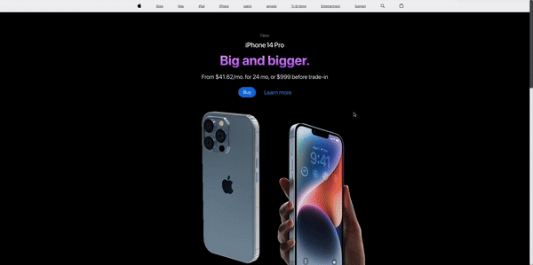

# 3D iPhone 🎬

A 3D model of the iPhone created using Three.js, a powerful JavaScript library for creating 3D content on the web. This project showcases a realistic, interactive 3D model of an iPhone rendered in a browser.

---

## Table of Contents

1. [Demo](#demo)
2. [Features](#features)
3. [Tech Stack](#tech-stack)

---

## Demo
 

---

## Features

Interactive 3D Model: Rotate, zoom, and pan the iPhone model to view it from various angles.

Responsive Design: The application adjusts seamlessly to different screen sizes and devices.

Realistic Rendering: High-quality textures and lighting for a lifelike appearance.

---

## Tech Stack

- **Frontend**:

Three.js: For rendering and animating 3D models.

JavaScript: To build interactivity and handle events.

-HTML5 & CSS3: For structuring and styling the application.

- **Build Tools**:
  - create react app
